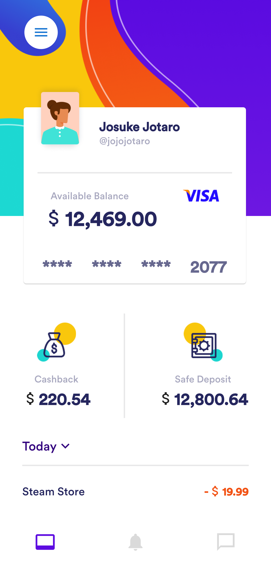
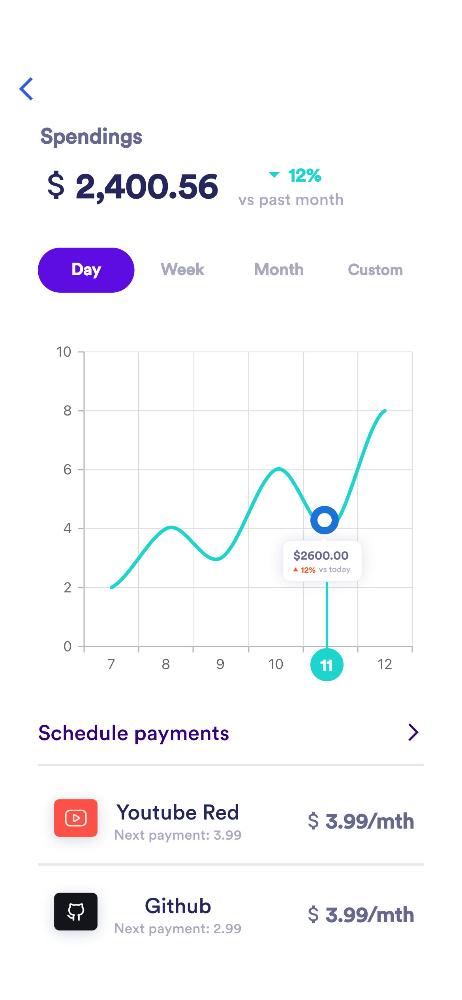

# credit_clan_task

A mobile wallet, that keeps track of a user's spending with analytics.

## Getting Started

This project is a task assigned by Credit clan, as flutter test assessment for a flutter role.

A few resources to get you started if this is your first Flutter project:

UI design by credit clan on figma: https://www.figma.com/file/FCZxUor6KOEEkdDGxfDE9t/Bank-app-rebound-concept?n

     
